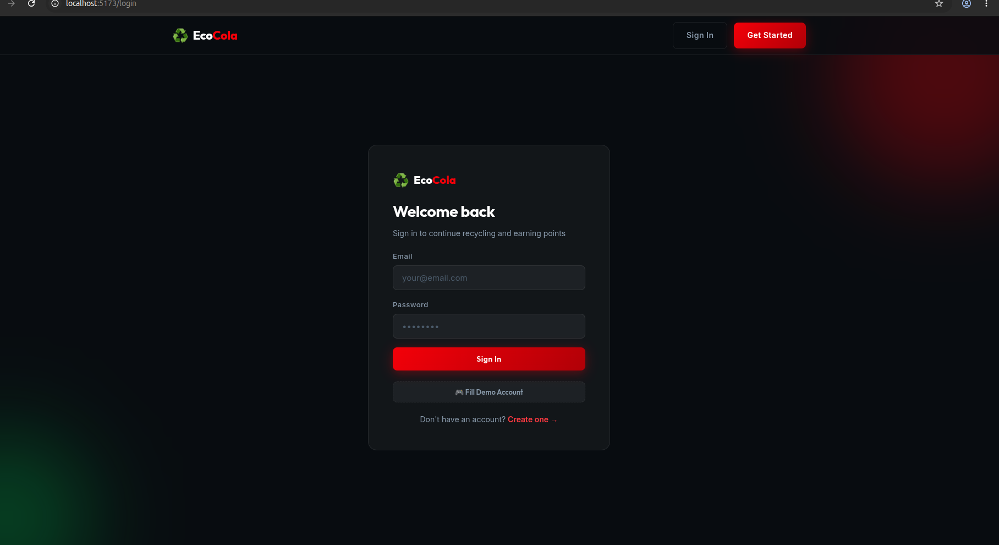
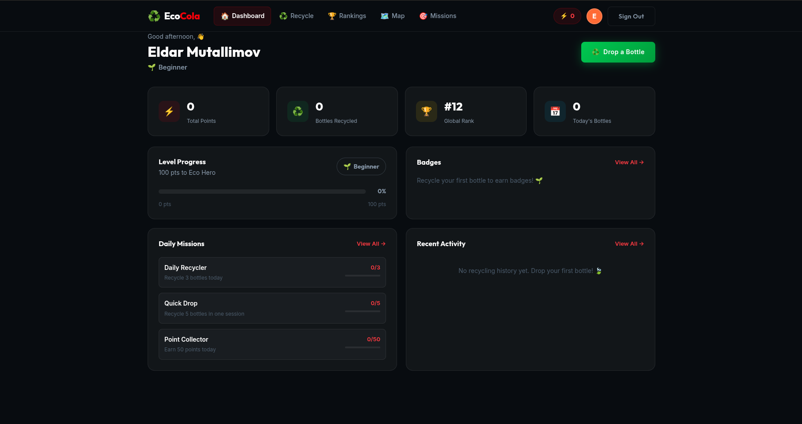
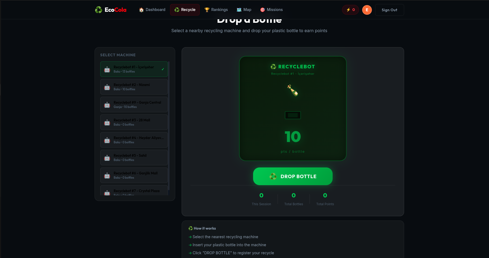
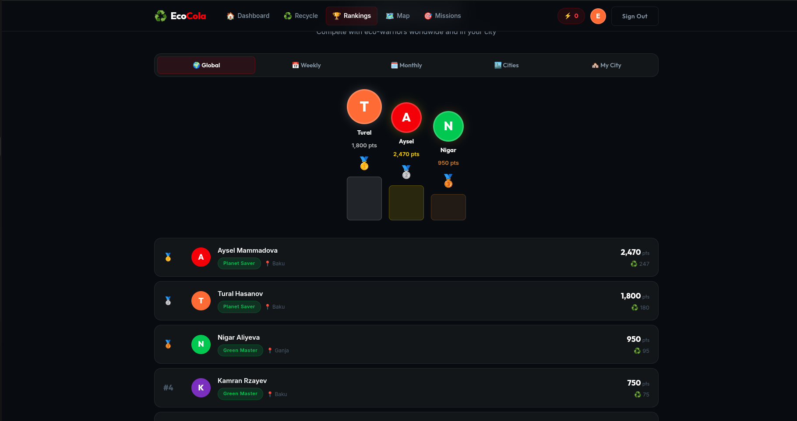
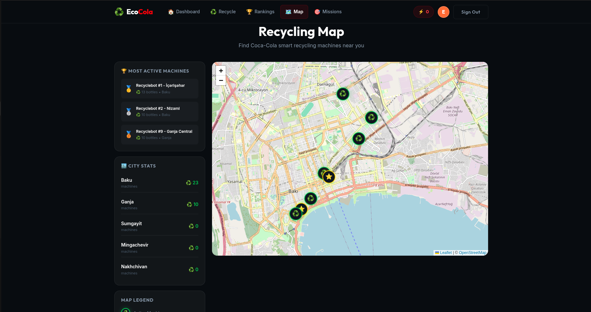
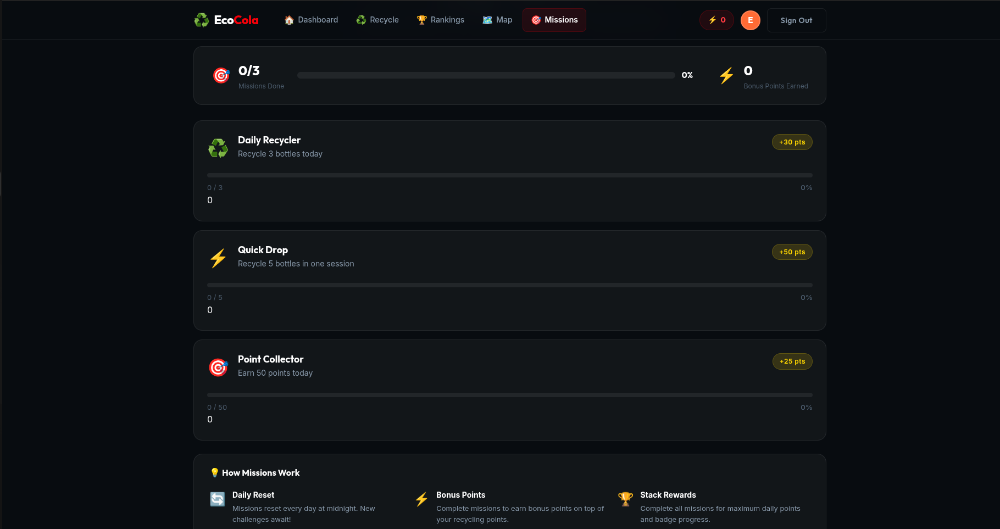

# ♻️ EcoCola — Coca-Cola Recycling Gamification Platform

<div align="center">


**A full-stack gamification platform that rewards users for recycling plastic bottles through smart recycling machines.**

[Features](#-features) • [Tech Stack](#-tech-stack) • [Getting Started](#-getting-started) • [API Docs](#-api-endpoints) • [Screenshots](#-screenshots)

</div>

---

## 📖 Overview

**EcoCola** is a web application built for the **Coca-Cola Hackathon** that gamifies the plastic bottle recycling experience. Users earn points by scanning bottles at smart recycling machines, level up through environmental tiers, earn badges, and compete on city and global leaderboards — all while tracking their positive environmental impact.

> 🌍 *"Every bottle counts. Every point matters. Every hero makes a difference."*

---

## 📸 Screenshots

### 🔐 Login Page

*Clean dark-themed login with demo account access*

### 📊 Dashboard

*Personal stats, level progress, daily missions & recent activity in one view*

### ♻️ Recycle — Drop a Bottle

*Select a nearby RecycleBot machine and earn 10 pts per bottle dropped*

### 🏆 Rankings

*Global, Weekly, Monthly, Cities and My City leaderboards with podium display*

### 🗺️ Recycling Map

*OpenStreetMap-powered map showing all RecycleBot locations across Azerbaijan*

### 🎯 Daily Missions

*Daily challenges with bonus points: Daily Recycler, Quick Drop, Point Collector*

---

## ✨ Features

### 🔐 Authentication
- User registration & login with JWT-based sessions
- Secure password hashing with `bcryptjs`
- Demo account quick-fill for testing
- Protected routes & persistent auth state
- User profile management

### ♻️ Bottle Recycling System
- Simulated **"Drop Bottle"** button (mimics smart RecycleBot machine interaction)
- Each bottle earns **10 points**
- Select nearest machine from list (Baku, Ganja & more)
- Full recycling history log with timestamps
- Per-session and cumulative stats

### 🎮 Gamification

**Levels:**
| Level | Name | Required Points |
|-------|------|----------------|
| 1 | 🌱 Beginner | 0+ |
| 2 | 🦸 Eco Hero | 100+ |
| 3 | 🌿 Green Master | 500+ |
| 4 | 🌍 Planet Saver | 1,500+ |

**Badges:**
- 🥉 First Recycler — 1st bottle
- 🏅 10 Bottles Club — 10 bottles
- 🥈 50 Bottles Star — 50 bottles
- 🥇 Century Champion — 100 bottles
- 💎 Legend — 500 bottles

### 🏆 Ranking System
- **Global** leaderboard with podium (🥇🥈🥉) display
- **Weekly** & **Monthly** competitive boards
- **Cities** ranking — compare Baku, Ganja, Sumgayit and more
- **My City** — local leaderboard
- Real-time rank updates on each recycle action

### 🗺️ Map Feature (OpenStreetMap + Leaflet)
- Interactive map of all RecycleBot machine locations
- Most active machines highlighted with rankings
- City-wide recycling statistics (Baku: 23 ♻️, Ganja: 10 ♻️, etc.)
- Custom map markers per machine status (active ⭐ / standard ♻️)
- Map legend for machine types

### 📊 Dashboard
- Live points & bottles counters
- Current rank (#12 Global) & level display
- Level progress bar with next level target
- Badge collection with progress
- Daily missions tracker (Daily Recycler, Quick Drop, Point Collector)
- Recent activity feed

### 🎯 Daily Missions
| Mission | Task | Bonus |
|---------|------|-------|
| Daily Recycler | Recycle 3 bottles today | +30 pts |
| Quick Drop | Recycle 5 bottles in one session | +50 pts |
| Point Collector | Earn 50 points today | +25 pts |

- Missions reset every day at midnight
- Bonus points stack on top of regular recycling points
- Complete all missions for maximum daily reward

---

## 🛠 Tech Stack

### Frontend
| Technology | Version | Purpose |
|------------|---------|---------|
| React | 18 | UI Framework |
| Vite | 8.0 | Build Tool & Dev Server |
| React Router | — | Client-side Routing |
| Leaflet.js | — | Interactive Map |
| Context API | — | Global State Management |

### Backend
| Technology | Version | Purpose |
|------------|---------|---------|
| Node.js | — | Runtime |
| Express | 5.x | Web Framework |
| better-sqlite3 | 12.x | Embedded Database |
| jsonwebtoken | 9.x | JWT Authentication |
| bcryptjs | 3.x | Password Hashing |
| uuid | 13.x | Unique ID Generation |
| cors | 2.x | Cross-Origin Requests |
| dotenv | 17.x | Environment Variables |

---

## 📁 Project Structure

```
Coca-Cola Hackathon/
├── frontend/                      # React + Vite application
│   ├── public/
│   ├── src/
│   │   ├── assets/                # Images, icons, static files
│   │   ├── components/            # Reusable UI components
│   │   ├── context/               # React Context (Auth, etc.)
│   │   ├── pages/                 # Page components
│   │   │   ├── LandingPage.jsx    # Home / hero page
│   │   │   ├── LoginPage.jsx      # Sign in
│   │   │   ├── SignupPage.jsx     # Register
│   │   │   ├── DashboardPage.jsx  # User dashboard
│   │   │   ├── RecyclePage.jsx    # Drop a bottle
│   │   │   ├── LeaderboardPage.jsx# Rankings
│   │   │   ├── MapPage.jsx        # Recycling map
│   │   │   ├── MissionsPage.jsx   # Daily missions
│   │   │   └── ProfilePage.jsx    # User profile
│   │   ├── api.js                 # API client (fetch/axios)
│   │   ├── App.jsx                # Root component & routing
│   │   └── main.jsx               # Entry point
│   ├── index.html
│   ├── package.json
│   └── vite.config.js
│
├── backend/                       # Express REST API
│   ├── src/
│   │   ├── routes/
│   │   │   ├── auth.js            # POST /api/auth/*
│   │   │   ├── users.js           # GET/PUT /api/users/*
│   │   │   ├── recycling.js       # POST /api/recycle/*
│   │   │   ├── leaderboard.js     # GET /api/leaderboard/*
│   │   │   ├── machines.js        # GET /api/machines/*
│   │   │   └── missions.js        # GET /api/missions/*
│   │   └── db.js                  # SQLite init & schema
│   ├── server.js                  # Express app entry point
│   ├── .env                       # Environment variables (not committed)
│   └── package.json
│
├── screenshots/                   # App screenshots for README
└── README.md
```

---

## 🗄️ Database Schema

```sql
-- Users table
CREATE TABLE users (
  id            TEXT PRIMARY KEY,
  name          TEXT NOT NULL,
  email         TEXT UNIQUE NOT NULL,
  password      TEXT NOT NULL,
  city          TEXT,
  points        INTEGER DEFAULT 0,
  bottles       INTEGER DEFAULT 0,
  level         INTEGER DEFAULT 1,
  team_id       TEXT,
  created_at    DATETIME DEFAULT CURRENT_TIMESTAMP
);

-- Recycling history
CREATE TABLE recycles (
  id            TEXT PRIMARY KEY,
  user_id       TEXT NOT NULL,
  machine_id    TEXT,
  points        INTEGER DEFAULT 10,
  recycled_at   DATETIME DEFAULT CURRENT_TIMESTAMP,
  FOREIGN KEY (user_id) REFERENCES users(id)
);

-- RecycleBot machines
CREATE TABLE machines (
  id            TEXT PRIMARY KEY,
  name          TEXT NOT NULL,       -- e.g. "Recyclebot #1 - İçərişəhər"
  city          TEXT NOT NULL,       -- e.g. "Baku"
  lat           REAL NOT NULL,
  lng           REAL NOT NULL,
  is_active     INTEGER DEFAULT 1,
  total_bottles INTEGER DEFAULT 0
);

-- Badges
CREATE TABLE badges (
  id            TEXT PRIMARY KEY,
  user_id       TEXT NOT NULL,
  badge_type    TEXT NOT NULL,
  earned_at     DATETIME DEFAULT CURRENT_TIMESTAMP,
  FOREIGN KEY (user_id) REFERENCES users(id)
);

-- Daily missions
CREATE TABLE missions (
  id            TEXT PRIMARY KEY,
  user_id       TEXT NOT NULL,
  title         TEXT NOT NULL,
  target        INTEGER NOT NULL,
  progress      INTEGER DEFAULT 0,
  completed     INTEGER DEFAULT 0,
  expires_at    DATETIME NOT NULL
);

-- Teams
CREATE TABLE teams (
  id            TEXT PRIMARY KEY,
  name          TEXT NOT NULL,
  city          TEXT,
  total_points  INTEGER DEFAULT 0,
  created_at    DATETIME DEFAULT CURRENT_TIMESTAMP
);
```

---

## 🔌 API Endpoints

### Auth — `/api/auth`
| Method | Endpoint | Description |
|--------|----------|-------------|
| `POST` | `/api/auth/register` | Register new user |
| `POST` | `/api/auth/login` | Login & receive JWT |
| `GET` | `/api/auth/me` | Get current user 🔒 |

### Users — `/api/users`
| Method | Endpoint | Description |
|--------|----------|-------------|
| `GET` | `/api/users/:id` | Get user profile |
| `PUT` | `/api/users/:id` | Update user profile 🔒 |
| `GET` | `/api/users/:id/badges` | Get user badges |
| `GET` | `/api/users/:id/history` | Get recycling history |

### Recycling — `/api/recycle`
| Method | Endpoint | Description |
|--------|----------|-------------|
| `POST` | `/api/recycle` | Drop a bottle (+10 pts) 🔒 |
| `GET` | `/api/recycle/stats` | Get user recycle stats 🔒 |

### Leaderboard — `/api/leaderboard`
| Method | Endpoint | Description |
|--------|----------|-------------|
| `GET` | `/api/leaderboard/global` | Global top users |
| `GET` | `/api/leaderboard/city/:city` | City-based ranking |
| `GET` | `/api/leaderboard/weekly` | Weekly leaderboard |
| `GET` | `/api/leaderboard/monthly` | Monthly leaderboard |

### Machines — `/api/machines`
| Method | Endpoint | Description |
|--------|----------|-------------|
| `GET` | `/api/machines` | All RecycleBot machines |
| `GET` | `/api/machines/nearby` | Nearest machines (lat/lng params) |
| `GET` | `/api/machines/active` | Most active machines |

### Missions — `/api/missions`
| Method | Endpoint | Description |
|--------|----------|-------------|
| `GET` | `/api/missions` | Get daily missions 🔒 |
| `POST` | `/api/missions/:id/complete` | Mark mission complete 🔒 |

### Health Check
| Method | Endpoint | Description |
|--------|----------|-------------|
| `GET` | `/api/health` | Server status & timestamp |

> 🔒 = Requires `Authorization: Bearer <token>` header

---

## 🚀 Getting Started

### Prerequisites
- **Node.js** v18+
- **npm** v9+
- Git

### 1. Clone the Repository

```bash
git clone https://github.com/YOUR_USERNAME/ecocola-recycling-platform.git
cd ecocola-recycling-platform
```

### 2. Backend Setup

```bash
cd backend
npm install
```

Create a `.env` file in the `backend/` directory:

```env
PORT=3001
JWT_SECRET=your_super_secret_jwt_key_here
NODE_ENV=development
```

Start the backend server:

```bash
npm run dev
# ✅ Server runs on http://localhost:3001
```

### 3. Frontend Setup

```bash
cd ../frontend
npm install
```

Create a `.env` file in the `frontend/` directory:

```env
VITE_API_URL=http://localhost:3001
```

Start the frontend dev server:

```bash
npm run dev
# ✅ App runs on http://localhost:5173
```

### 4. Open in Browser

```
http://localhost:5173
```

> 💡 Use the **"Fill Demo Account"** button on the login page to instantly test the app without registering.

---

## 🌐 Environment Variables

### Backend (`backend/.env`)
| Variable | Description | Example |
|----------|-------------|---------|
| `PORT` | Server port | `3001` |
| `JWT_SECRET` | JWT signing secret | `mysecretkey123` |
| `NODE_ENV` | Environment | `development` |

### Frontend (`frontend/.env`)
| Variable | Description | Example |
|----------|-------------|---------|
| `VITE_API_URL` | Backend API base URL | `http://localhost:3001` |

---

## 🤝 Contributing

1. Fork the repository
2. Create your feature branch: `git checkout -b feature/amazing-feature`
3. Commit your changes: `git commit -m 'feat: add amazing feature'`
4. Push to the branch: `git push origin feature/amazing-feature`
5. Open a Pull Request

---

## 👥 Team

Built with ❤️ for the **Coca-Cola Hackathon**

---

## 📄 License

This project is licensed under the **ISC License** — see the [LICENSE](LICENSE) file for details.

---

<div align="center">

**♻️ Recycle More. Earn More. Save the Planet.**

*Made with 🌱 for a greener future — EcoCola © 2026*

</div>
